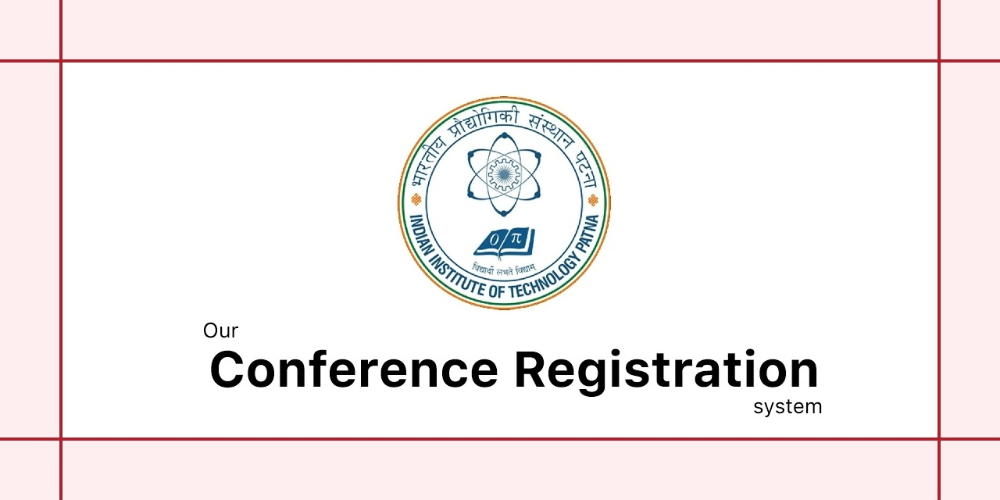

  

# Conference Registration System

**Course**: BO CDA 108: Capstone Project I  
Indian Institute of Technology Patna

This repository contains the implementation of a web based Conference Registration System developed as part of the course BO CDA 108: Capstone Project I. The system provides a structured platform through which users can access conference information and complete the registration process online.

The objective of the project is to demonstrate the development of a simple event registration platform using core web technologies while maintaining a clear and organized user interface.

The web interface of the system is implemented using HTML, CSS, and JavaScript. These technologies manage the page structure, visual styling, and client side interaction of the application.

The platform presents essential conference information such as the event overview, schedule, speakers, and related details. A registration module allows participants to submit their participation information.

For backend data management, the system integrates Firebase as a database service. Registration data submitted through the form is processed using JavaScript and stored in Firebase. This allows organizers to collect and manage participant records without requiring a traditional server side infrastructure.

## Technologies

* HTML
* CSS
* JavaScript
* Firebase

## Project Team

[1] **Anurag Das**  provided supporting contributions during development.

[2] **Ankush Chowdhury** provided supporting contributions during development.

[3] **Harshwardhan Das** provided supporting contributions during development.

[4] **Shraban Das** provided supporting contributions during development.

[5] **Soham Das** provided supporting contributions during development.

[6] **Aman Chourasia**  is the project lead and provided supporting contributions during development.

---

**Project Type:** Capstone Project

**Program**  
BS–MS (2025 to 2030)  
Computer Science and Data Analytics (CSDA)  

**Institution**  
Indian Institute of Technology Patna (IIT Patna)  
Bihta Kanpa Road  
Patna, Bihar, India – 801106

© 2026 Conference Registration System Project Team
