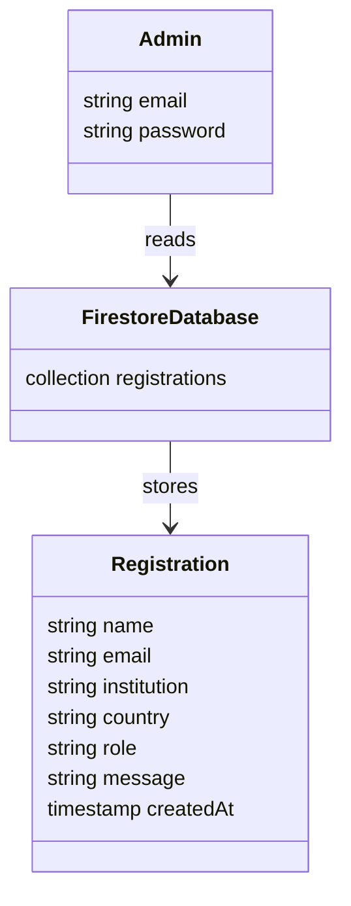

# Database Design

This document describes the database design used in the Conference Registration System. The application uses Firebase Firestore, a NoSQL database by Google. The design models the main entities involved in the system using class diagrams. The database is designed to support two operations:
* Storing participant registrations
* Allowing authenticated administrators to view submitted registrations

## Overview

The Firestore database organizes information in collections and documents. The collection used in the system is:

```
registrations
```

Each document inside this collection represents a single conference participant registration.

## Main entity "Registration"

The core data entity in the system is the Registration class. Each instance represents one user who has registered for the conference. Typical fields stored for each registration include:
* name
* email
* institution
* country
* role
* message
* createdAt (timestamp)
These attributes are stored as fields inside a Firestore document.

## Class Diagram

The following class diagram represents the logical structure of the database entities used in the system.



## Entity description

### 1. Registration

The registration entity represents a participant who has registered for the conference through the online form.

Attributes:
* name
* email
* institution
* country
* role
* message
* createdAt

Each registration is stored as a document in the Firestore collection.

### Admin

Admin can access the dashboard to view submitted registrations. Admin accounts are managed using Firebase Authentication. The authentication system stores user credentials securely and manages login sessions.

Attributes:
* email – administrator login identifier
* password – credential stored securely by Firebase Authentication

Administrators do not directly modify database records but are permitted to read registration data.

## Firestore collections

```
registrations
   ├── docID_1
   │     ├── name
   │     ├── email
   │     ├── affiliation
   │     ├── citizenship
   │     ├── category
   │     └── createdAt
   │
   ├── docID_2
   │     ├── name
   │     ├── email
   │     ├── affiliation
   │     ├── citizenship
   │     ├── category
   │     └── createdAt
   │
   ├── docID_3
   │     ├── name
   │     ├── email
   │     ├── affiliation
   │     ├── citizenship
   │     ├── category
   │     └── createdAt
```

Each document identifier is generated automatically by Firestore when a new registration is submitted.


## Data access model

The system follows a controlled access model based on Firebase security rules.

* Public users are allowed to create registration documents
* Only authenticated administrators are allowed to read registration data

This ensures that participant data remains protected while still allowing open conference registration.
