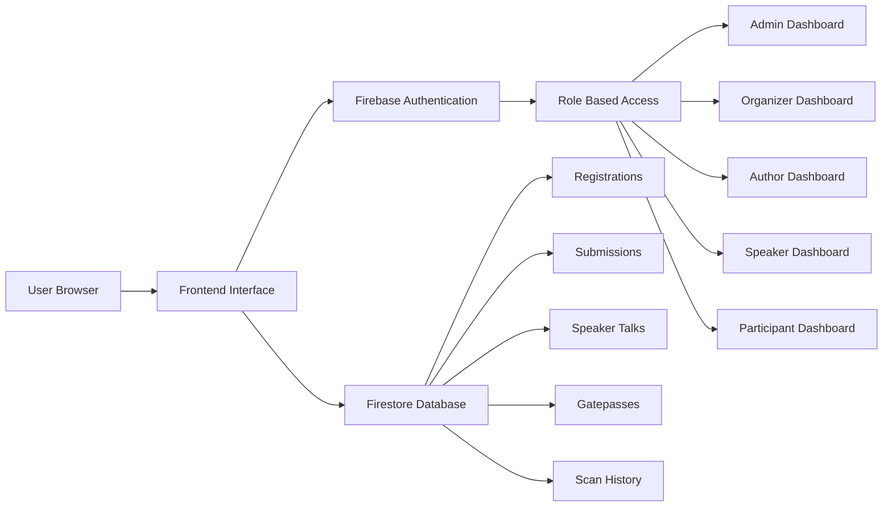
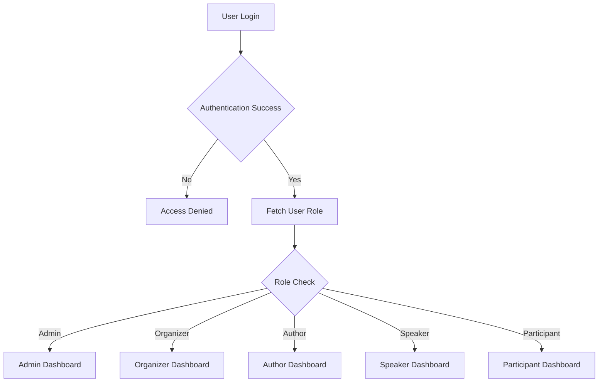
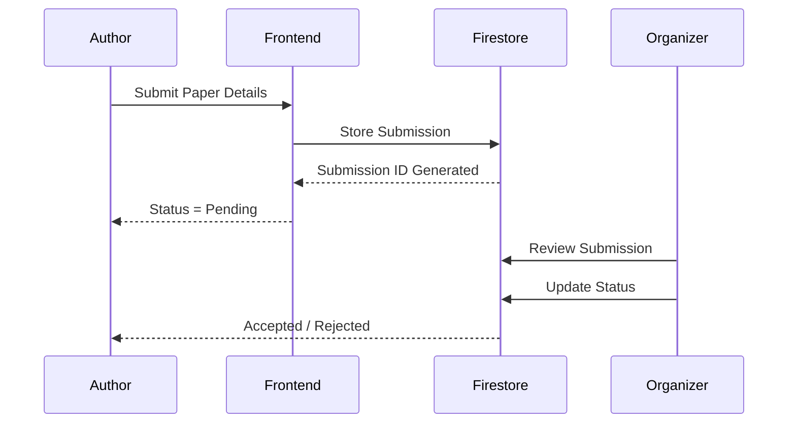
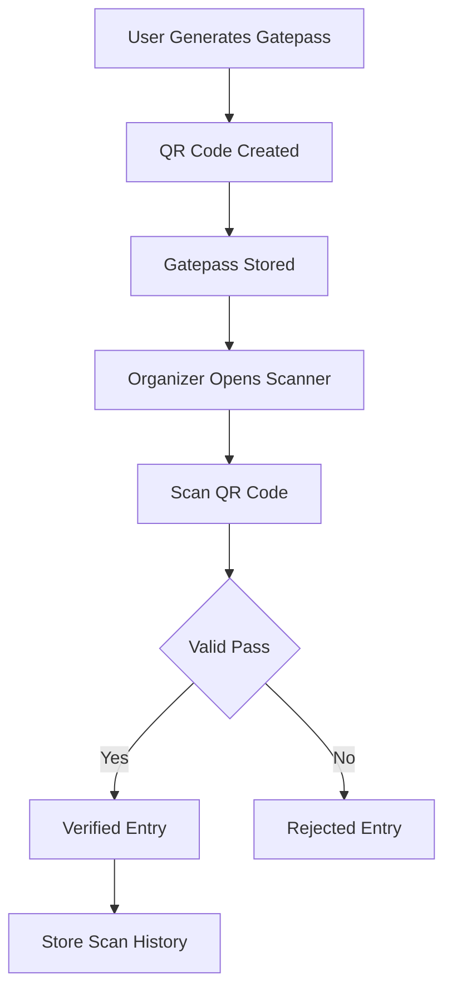

Diagram 1: Overall System Design

```mermaid
flowchart LR

A[User Browser] --> B[Frontend Interface]

B --> C[Firebase Authentication]

B --> D[Firestore Database]

C --> E[Role Based Access]

E --> F[Admin Dashboard]
E --> G[Organizer Dashboard]
E --> H[Author Dashboard]
E --> I[Speaker Dashboard]
E --> J[Participant Dashboard]

D --> K[Registrations]
D --> L[Submissions]
D --> M[Speaker Talks]
D --> N[Gatepasses]
D --> O[Scan History]
```

Diagram 2: Authentication and Role Workflow

```mermaid
flowchart TD

A[User Login] --> B{Authentication Success}

B -->|No| C[Access Denied]

B -->|Yes| D[Fetch User Role]

D --> E{Role Check}

E -->|Admin| F[Admin Dashboard]

E -->|Organizer| G[Organizer Dashboard]

E -->|Author| H[Author Dashboard]

E -->|Speaker| I[Speaker Dashboard]

E -->|Participant| J[Participant Dashboard]
```

Diagram 3: Paper Submission Workflow

```mermaid
sequenceDiagram

participant A as Author
participant F as Frontend
participant DB as Firestore
participant O as Organizer

A->>F: Submit Paper Details

F->>DB: Store Submission

DB-->>F: Submission ID Generated

F-->>A: Status = Pending

O->>DB: Review Submission

O->>DB: Update Status

DB-->>A: Accepted / Rejected
```

Diagram 4: QR Gatepass Verification Workflow

```mermaid
flowchart TD

A[User Generates Gatepass]

A --> B[QR Code Created]

B --> C[Gatepass Stored]

C --> D[Organizer Opens Scanner]

D --> E[Scan QR Code]

E --> F{Valid Pass}

F -->|Yes| G[Verified Entry]

F -->|No| H[Rejected Entry]

G --> I[Store Scan History]
```
