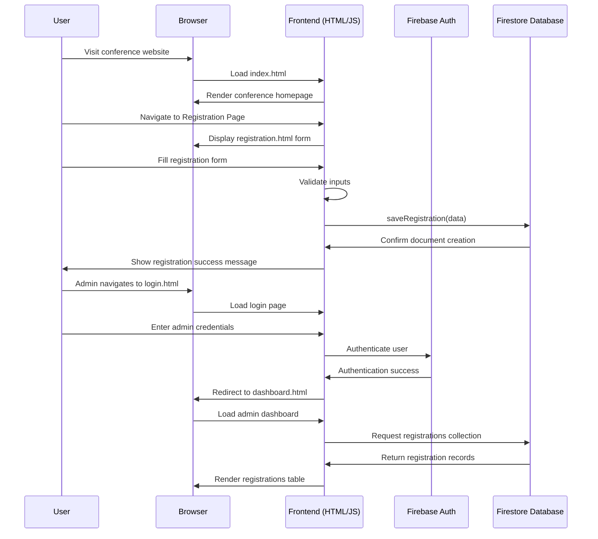
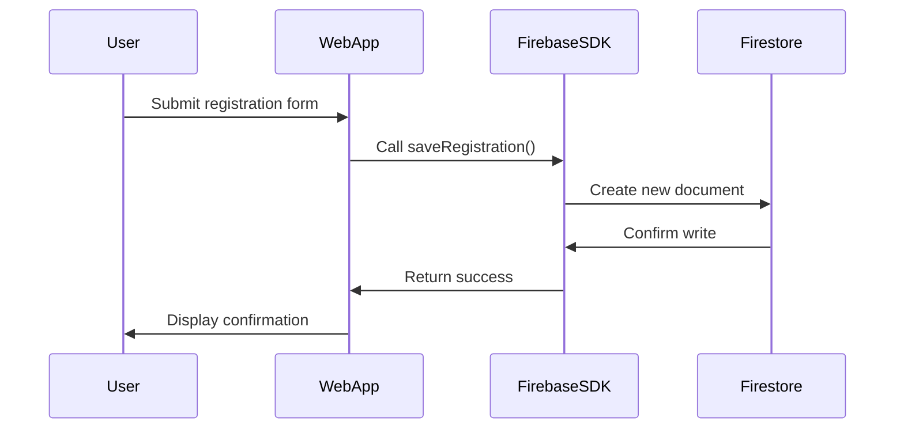
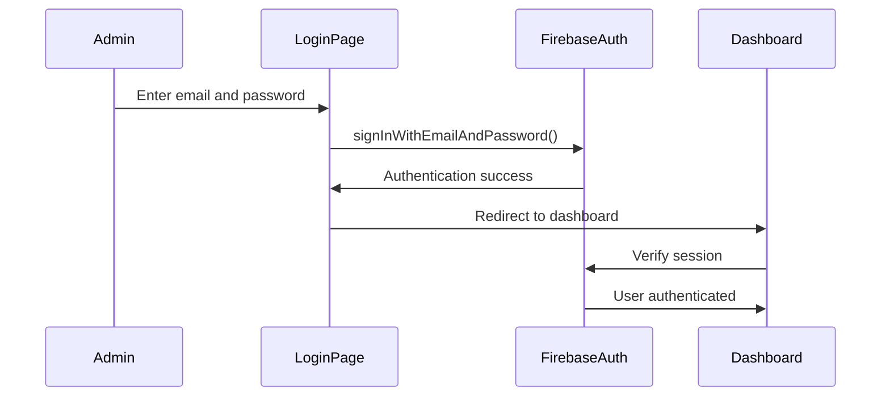

# System Architecture

This document describes system architecture (workflow) of the Conference Registration System. The system has  a client side architecture where the user interface communicates directly with Firebase services using the Firebase Web SDK. The platform consists of three principal layers:
1. Client Layer – browser interface built with HTML, CSS, and JavaScript
2. Application Logic Layer – frontend scripts handling form validation, authentication, and database operations
3. Backend Services Layer – firebase services including Firestore and Authentication

## Hgh level system flow



## User workflow

1. The user opens the conference website in a web browser.
2. The browser loads the main entry page (`index.html`).
3. The user navigates to the registration page (`registration.html`).
4. The user enters their personal details in the registration form.
5. The frontend JavaScript performs basic validation.
6. The form data is sent to the Firestore database using the Firebase SDK.
7. Firestore creates a new document within the `registrations` collection.
8. The user receives a confirmation that the registration has been recorded.

## Admin workflow

1. The administrator opens the login page (`login.html`).
2. The administrator enters valid email and password credentials.
3. The credentials are verified using Firebase Authentication.
4. Upon successful authentication, the user session is established.
5. The administrator is redirected to the dashboard (`dashboard.html`).
6. The dashboard queries Firestore for the `registrations` collection.
7. Registration records are retrieved and rendered in a tabular format.

## Data flow b/w front and back



## Auth flow

Administrative authentication is handled entirely through Firebase Authentication.



## Security model

There are policies through Firebase security rules, they are:
* Public users are permitted to submit registrations
* Only authenticated administrators may read registration data

Example,

```text
Public Access - create registration documents
Admin Access - read registration documents
```

This approach ensures, the database remains protected while still allowing open registration for conference participants.
